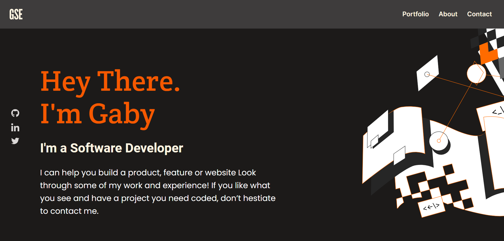
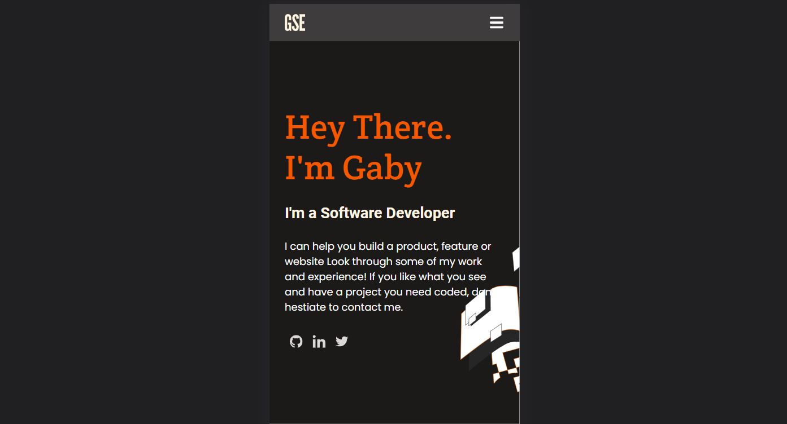

# Portfolio

> The portfolio displays the software developer presentation like skills, software projects, and a contact form.

## Built With

- Javascript
- HTML/CSS

## Live demo

[Gabriela's Portfolio](https://gabyse1.github.io/portfolio)

## Getting Started

To get a local copy up and running follow these simple example steps.

### Prerequisites

- Have `git` installed on your local computer.

### Install

- Clone this repository to your local computer. Choose the location you prefer.

### Usage

- Execute the `index.html` file to open it in a browser.

## Authors

👤 **Gabriela Sánchez**

- GitHub: [@gabyse1](https://github.com/gabyse1)
- Twitter: [@gabyse0](https://twitter.com/gabyse0)
- LinkedIn: [Gabriela](https://www.linkedin.com/in/gabriela-s%C3%A1nchez-espirilla-83011b225/)

## Contributors

👤 **Andrés Felipe Arroyave Naranjo**
- GitHub: [@JohnFTitor](https://github.com/JohnFTitor)
- Twitter: [@johnftitor](https://twitter.com/johnftitor)
- LinkedIn: [Andres](https://www.linkedin.com/in/andresfelipe117/?locale=en_US)

👤 **Oyelakin Ridwan**
- GitHub: [@oyelakinG9](https://github.com/JohnFTitor)

## 🤝 Contributing

Contributions, issues, and feature requests are welcome!

Feel free to check the [issues page](../../issues/).

## Show your support

Give a ⭐️ if you like this project!

## Acknowledgments

- Linter https://github.com/microverseinc/linters-config
- Readme template https://github.com/microverseinc/readme-template
- Figma template https://www.figma.com/file/l7SqJ3ZfkAKih9sFxvWSR4/Microverse-Student-Project-1?node-id=1%3A1471

## 📝 License

This project is [MIT](./MIT.md) licensed.
